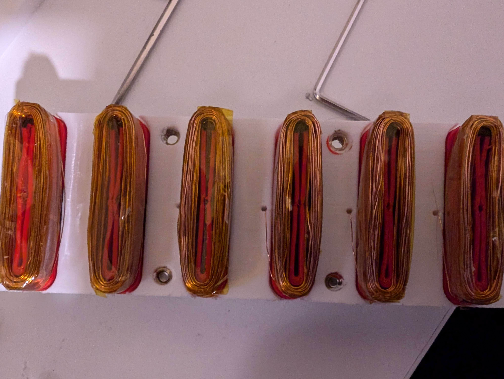

# EnderWinder

A tool for generating G-code to lay copper wire along custom 3D paths on Ender-style printers. Includes tension control and hardware for guiding the wire around complex forms.

**Early development** – features are experimental and incomplete.

## Goals

- Wind multi-layer coils with precision
- Ensure consistent coil resistance and turn count
- Easy setup and support for different wire diameters

## Hardware Concept

EnderWinder should be able to wind coils similar to these from the `prototype_v0` linear motor — but with improved accuracy, repeatability, and uniformity.
